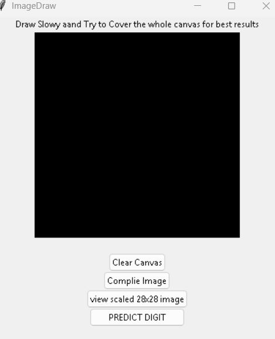

# RawNeuralCanvas
A zero-dependency MLP Network and backpropagation engine built entirely from scratch in NumPy - no PyTorch, no TensorFlow, no ML frameworks of any kind.
This project can also serve as a learning tool for beginners exploring machine learning.  
The GUI allows users to tweak training parameters and observe how changes affect neural network behavior and learning dynamics.

## Demo
Draw a digit on the canvas and let the trained neural network predict it.

## Features
- Backpropagation from first principles
- Stochastic gradient descent, Mini-Batch and Full-Batch gradient descent
- Data augmentation (rotation + translation)
- Real-time cost graph during training
- Tkinter GUI with full training interface for tweaking parameters
- Canvas draw prediction — draw a digit, get a prediction using your model
- Model saving and loading using `.npz` 

## How to Run
1. Clone the repo
2. pip install -r requirements.txt
3. python main.py

## Results
~90% test accuracy on MNIST with [784, 16, 16, 10] architecture

## Roadmap

**Currently Implementing**
- Threaded training so GUI stays responsive during training
- Accuracy evaluation and confusion matrix

**Planned**
- Integration of multiple activation functions (ReLU, Softmax) and weight initializations
- Different Cost functions such as cross-entropy
- Adam optimizer, variable learning rate
- Validation set tracking
- Auto - encoders
- CNNs 